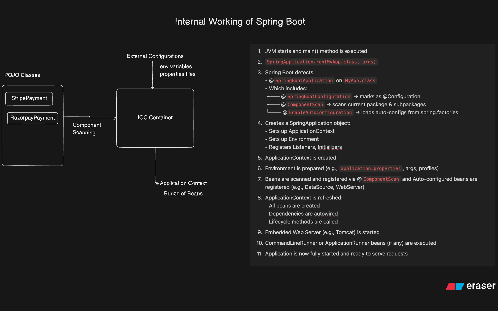

# ✅ Week 1: Introduction to Spring & Spring Boot

---

## 1. What Is Spring?

Spring is a **Java framework that simplifies enterprise application development** by solving:

* Dependency Management
* Object Lifecycle Management
* Configuration Complexity
* Scalability & Testability

### ❌ Problem With Traditional Java (Tightly Coupled Code)

```java
class OrderService {
    private PaymentService paymentService = new PaymentService();
}
```

### 🔴 Issues in the Above Code

* Tight coupling
* Hard to test or mock
* No centralized object lifecycle
* Poor scalability
* Scattered object creation
* Violates SOLID principles

This approach becomes **dangerous at scale**, like in:

* Amazon Order Processing
* Instagram Feed Pipelines
* OpenAI API serving layers

---

## 2. JEE (Java Enterprise Edition) Problems

Before Spring, developers struggled with:

* Manual JDBC & ORM integration
* Heavy XML configuration
* Deployment complexity
* Repetitive boilerplate code
* Poor modularity

➡️ Spring was created to **simplify all of this**.

---

## 3. What Does Spring Provide?

Spring solves **Dependency Injection + Object Lifecycle + Modular Design**.

### Spring Ecosystem

* Spring Core (IoC, Beans)
* Spring Context
* Spring AOP
* Spring Web (MVC, WebSockets)
* Spring Data (JPA, JDBC, ORM)
* Spring Security
* Spring Kafka
* Spring Cloud
* Spring Integration
* Spring State Machine

---

## 4. History of Spring

| Year        | Event                           |
| ----------- | ------------------------------- |
| Early 2000s | Heavy J2EE, manual DI           |
| 2004        | Inversion of Control introduced |
| 2004–2017   | Maintained by VMware            |
| 2014        | Spring Boot Released            |

---

## 5. What Is Spring Boot?

> **Spring Boot = Spring Framework + Auto-Configuration + Embedded Server + Developer Tooling**

### ✅ Why Spring Boot Exists

* No XML configs
* Auto-configured dependencies
* Embedded Tomcat/Jetty
* Production-ready apps in minutes

---

## 6. Core Spring Concepts You Must Know

### ✅ Inversion of Control (IoC)

Spring **controls object creation**, not you.

---

### ✅ Dependency Injection (DI)

Types:

* Constructor Injection ✅ Preferred
* Setter Injection
* Field Injection ❌ Avoid in production

---

### ✅ Spring Beans

> A **Bean is a Java object managed by Spring IoC Container**.

```java
@Component
class PaymentService {}
```

Injected via:

```java
@Autowired
private PaymentService paymentService;
```

---

### ✅ Application Context (IoC Container)

Spring's Brain that:

* Creates Beans
* Injects Dependencies
* Manages Lifecycle
* Handles Scopes

---

### ✅ MVC Annotations

| Purpose   | Annotation        |
| --------- | ----------------- |
| API Layer | `@RestController` |
| Web Pages | `@Controller`     |
| Routing   | `@RequestMapping` |
| Services  | `@Service`        |
| DAO Layer | `@Repository`     |

---

## 7. Creating Beans Manually

```java
@Configuration
public class AppConfig {

    @Bean
    public PaymentService paymentService() {
        return new PaymentService();
    }
}
```

### ✅ Priority Order

```
@Configuration > @Component / @Service / @Controller
```

---

## 8. Bean Lifecycle

| Phase                | Description        |
| -------------------- | ------------------ |
| Creation             | Bean instantiated  |
| Dependency Injection | Dependencies wired |
| Initialization       | Post setup         |
| Usage                | Bean used          |
| Destruction          | Cleanup            |

### Lifecycle Hooks

```java
@PostConstruct
@PreDestroy
```

✅ Used heavily in:

* DB connection pools
* Kafka consumers
* Cache loaders

---

## 9. Bean Scopes

| Scope         | Use Case             |
| ------------- | -------------------- |
| `singleton`   | Default, services    |
| `prototype`   | New object each time |
| `request`     | One per HTTP request |
| `session`     | One per user         |
| `application` | Global config        |

---

## 10. Dependency Injection Example

❌ Tight Coupling

```java
class OrderService {
  private EmailService emailService = new EmailService();
}
```

✅ Loose Coupling (Constructor Injection)

```java
class OrderService {

  private final EmailService emailService;

  public OrderService(EmailService emailService){
    this.emailService = emailService;
  }
}
```

✅ Benefits:

* Immutable dependencies
* Easy Testing
* Flexible switching (Email → SMS → Push)

---

## 11. Multiple Bean Conflict Handling

If multiple beans exist:

| Strategy                 | Priority           |
| ------------------------ | ------------------ |
| Env Variable             | ✅ Highest          |
| `@ConditionalOnProperty` | ✅                  |
| `@Qualifier`             | ✅                  |
| `@Primary`               | ✅ Default fallback |

---

## 12. Spring Boot vs Spring Framework

| Feature    | Spring        | Spring Boot         |
| ---------- | ------------- | ------------------- |
| Setup      | Manual        | Auto-config         |
| Server     | External      | Embedded            |
| Config     | Heavy XML     | Zero XML            |
| Use Case   | Custom legacy | Modern apps         |
| Popularity | Medium        | ✅ Industry standard |

---

## 13. Project Setup Using Spring Initializr

* Visit: [https://start.spring.io](https://start.spring.io)
* Select:

  * Maven
  * Java
  * Spring Boot Version
  * Dependencies (Web, JPA, Security)

---

## 14. Spring Boot Project Structure

```
src/main/java    → Business Logic
src/main/resources → application.properties
src/test/java → Unit & Integration Tests
pom.xml → Dependency Manager
```

---

## 15. Real-World Production Mapping

| Concept     | Real-World Use         |
| ----------- | ---------------------- |
| Beans       | Microservices          |
| IoC         | Kubernetes Pod Control |
| DI          | Feature toggles        |
| Profiles    | Dev/Stage/Prod         |
| Auto Config | AWS Infra Boot         |

Used daily at:

* Amazon Seller APIs
* Instagram Backend
* OpenAI API Servers
* Netflix Streaming

---

## 16. What You Will Learn Next

* Auto Configuration & Internals
* Spring Application Context Flow
* Maven Build Tool
* REST API Design
* Schema Design
* Live Project: Airbnb Clone

---

# ✅ Revision Summary

* ✅ Spring removes manual object wiring
* ✅ Spring Boot removes all setup pain
* ✅ Beans + IoC = scalable architecture
* ✅ DI enables testable & modular systems
* ✅ Used in **billions of API calls daily**

---

If you want, next I can:

✅ Add **diagrams for IoC, Beans, MVC flow**
✅ Explain **Auto-Configuration Internals step-by-step**
✅ Convert this into **interview-ready Q&A format**
✅ Map this to **your Amazon production systems**


### Auto configuration, Application Context & Internal working of a Spring boot Application 

**Auto-Configuration**
Auto-Configuration is a mechanism which loads/configures spring application based on the classpath & other specified dependencies in settings.

**How Auto-Configuration works**

1. It does the classPath scaning : Scans the classpath for presence of certain libraries & classes, then applied corresponding configurations 
2. Congfiguration Classes : Spring Boot contains numerous autoconfiguration classes, each responsible for configuring a specific part of the application.
3. Conditional beans : Each autoconfiguration class uses conditional checks to decide if it should be applied. These conditions include the presence of specific classes, the absence of user-defined beans, and specific property settings.

> [Checkout offical-link](https://docs.spring.io/spring-boot/docs/current/reference/html/features.html) 


**Spring Boot Internal flow**

1. Initialization : When you start a Spring Boot application, the main entry point is typically a class annotated with @SpringBootApplication (or its meta-annotations). This annotation combines several other annotations such as @Configuration, @EnableAutoConfiguration, and @ComponentScan.
2. Spring Application Context creation : Spring Boot creates an application context, which serves as the container for managing beans and their dependencies. It scans the classpath for components, configurations, and auto-configurations, and initializes application context based on the detected classes and dependencies.
3. Auto Configuration : Spring Boot auto-configures beans and components based on the classpath and detected dependencies. It uses conditional annotations (@ConditionalOnClass, @ConditionalOnBean, etc.) to conditionally configure beans only if certain conditions are met.
4. Externalized configuration : Spring Boot loads configuration properties from various sources, such as property files, YAML files, environment variables, and command-line arguments. It provides sensible default values for configuration properties and allows them to be easily overridden or customized.
5. Embedded Web server Initialization : If the application is a web application, Spring Boot initializes the embedded web server (such as Tomcat, Jetty, or Undertow) based on the application's dependencies and configurations. It configures the server with sensible defaults and starts it to listen for incoming requests.
6. Application startup : Spring Boot invokes lifecycle callbacks such as @PostConstruct methods and initialization callbacks on beans as the application context is being initialized. Beans are instantiated, dependencies are injected, and any necessary initialization logic is executed.
7. Application ready : Once the initialization process is complete, the application context is fully initialized and ready to handle requests. The embedded web server is up and running, and the application is ready to serve incoming HTTP requests.


### Maven build tool 

### Tasks 
1. Make a list of all the annotations learned until this module & there use cases
| Annotation | Purpose |
| @Component | At class level, makes the regular java class to Spring managed bean |
| @EnableAutoConfiguration | At springboot application level, enables all the configurations required for running the application |
| @ComponentScan | At application level, scans all the beans, marked using @Component |
| @Bean | Spring managed POJO class | 
| @Scope | Method, or attribute level, defines how the behaviour of object to be created, @Scope("prototype") -> multiple object instances, @Scope("singleton") -> only single instance of object at application level |
| @Primary | Used, when multiple beans are injected at runtime, with @Primary, we can specify this is primary bean to get injected | 
| `@Qualifier` | used, when dealing with multiple beans injecttion at runtime | 
| `@ConditionalOnProperty`(name = "notification.type", havingValue = "email") |  used when dealing with multiple beans injecttion at runtime |

2. Make a list of scenarios where you feel spring boot is more useful than spring framework 
- Spring framework is a dependency injection framework, it has IOC container & Application context to manage the depdencies, which gets injected at runtime, where as SpringBoot provides a more additional features, like embedded tomcat server, quick application headsup and less configurations. 

- Create a class called CakeBaker, that is dependent on two other classes called Frosting and Syrup. This class has a function called bakeCake(). 
- Create two interfaces of type Frosting and Syrup with a function called getFrostingType and getSyrupType respectively. 
- Create two implementations of these two interfaces (so total 4 classes) for Chocolate and Strawberry flavors. 
- Use Dependency injection to inject the Frosting and Syrup dependencies into CakeBaker and also to call the bakeCake function of the CakeBaker class.

